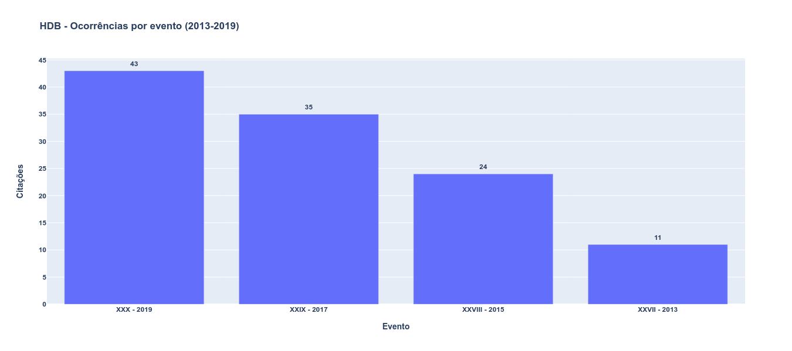
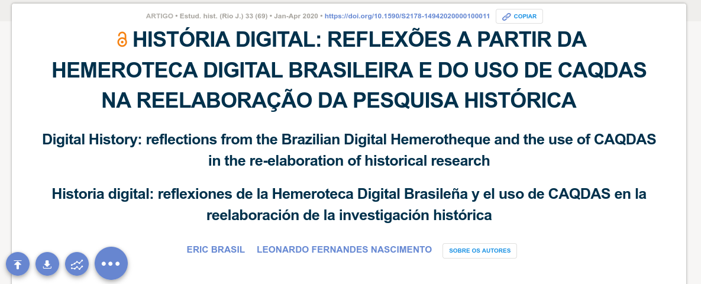

layout: true

```{r setup, include=FALSE}
options(htmltools.dir.version = FALSE)

knitr::opts_chunk$set(
	echo = FALSE,
	fig.align = "center",
	message = FALSE,
	warning = FALSE,
	cache = FALSE
)
```

```{r eval=FALSE, include=FALSE}
library(knitr)
library(tidyverse)
library(widgetframe)
```
---
class: bg_green, center, middle

# Qual futuro da pesquisa histórica?

```{r, out.width="60%"}
knitr::include_graphics("https://media1.giphy.com/media/Xch9I90tRezyicQgma/giphy.gif")
```

---
class: bg_yellow, center, middle

## "Digital turn" nas humanidades

```{r, out.width="50%"}
knitr::include_graphics("https://media3.giphy.com/media/f1UH5LwVuWucM/giphy.gif?cid=ecf05e47kx6wnnnf9m6wg9c8k4a1cpe9kprem9pun2rglbxu&rid=giphy.gif&ct=g")
```

---
class: bg_yellow, center, middle

## Dataficação ([Mayer-Schönberger e Cukier, 2013](https://books.google.com.br/books?id=uy4lh-WEhhIC))

```{r, out.width="30%"}
knitr::include_graphics("https://media0.giphy.com/media/huyZxIJvtqVeRp7QcS/giphy.gif?cid=ecf05e47a29ik8uv2s8sr8lzbeo2colwxw7mg1h4wgo97ami&rid=giphy.gif&ct=g")
```

---
class: bg_yellow, center, middle

## Questões éticas ([Salganik, 2017](https://www.bitbybitbook.com/))
<br>

--
### O que muda com as pesquisas na era digital?

---
class: bg_yellow, center, middle

## Digitalização das fontes históricas
<br>

--
### - Rematerialização
<br>

--
### - Dados e metadados
<br>

--
### - "Mutação epistemológica fundamental"
<br>

---
class: bg_green, center, middle

# O caso da Hemeroteca Digital da Biblioteca Nacional

```{r, out.width="30%"}

```

---
class: bg_yellow, center, middle

## Difusão nas pesquisas em história
<br>
--

### - Acesso aos periódicos remotamente 
<br>
--

### - Salvar imagens
<br>
--

### - Busca por palavras
<br>

---
class: bg_yellow, middle, center

## Mas e as citações?
<br>

--
### - Sem padrão e sem transparência  

---
class: bg_yellow, middle, center

## O caso dos papers da Anpuh
<br>

### Pesquisa realizada por Ana Carolina Veloso, bolsista PIBIC / FAPESB.

### Para mais informações [clique aqui](https://ericbrasiln.github.io/pibic_2020-2021/hdb/)

---
class: bg_yellow, middle, center

## Papers publicados nos Anais dos SNH da Anpuh com ocorrências dos termos vínculados à HDB por evento

```{r, out.width="80%"}

```

---
class: bg_yellow, middle, center

## Padrões de utilização dos termos vínculados à HDB nas citações encontradas

```{r, out.width="80%"}
knitr::include_graphics("img/newplot(1).png")
```

---
class: bg_green, middle, center

# Interface da HDB e seus impactos epistemológicos
<br>

```{r, out.width="30%"}
knitr::include_graphics("img/noun_Fishing_3839395.png")
```

---
class: bg_yellow, middle, center

### 1. Parâmetros de busca 
<br>

--
### 2. Padrão de resultados
<br>

--
### 3. OCR, XML, Metadados?
<br>

---
class: bg_green, middle, center

# Por uma heurística digital
<br>

```{r, out.width="30%"}
knitr::include_graphics("img/noun_algorithm_3048214.png")
```

---
class: bg_yellow, middle, center

### 1. Registro de procedimentos metodológicos 
<br>
--

### 2. Potencial de pesquisas com técnicas de DH
<br>

--
### 3. Seremos todos programadores?
<br>

---
class: bg_yellow, middle, center 

```{r, out.width="70%"}

```

### Revista Estudos Históricos, v. 33, n. 69, p. 196–219, jan. 2020. DOI: 10.1590/S2178-14942020000100011

[Clique para acessar](https://doi.org/10.1590/S2178-14942020000100011) 

---
class: bg_yellow, middle, center

## Eric Brasil
<br>

### Email: [profericbrasil@unilab.edu.br](mailto:profericbrasil@unilab.edu.br)

### GitHub: [ericbrasiln](https://github.com/ericbrasiln/)

### Twitter: [@ericbrasiln](http://www.twitter.com/ericbrailn) 

### [Orcid](https://orcid.org/0000-0001-5067-8475) - [Lattes](http://lattes.cnpq.br/6853705640900524)

### [Site pessoal](https://ericbrasiln.github.io)

---
class: bg_yellow, middle, center

```{r, out.width="25%"}
knitr::include_graphics("img/logo_hist.png")
```

## Curso de Licenciatura em História

### Instituto de Humanidades e Letras do campus dos Malês, Unilab

### [Site do curso](historia.males.unilab.edu.br/) 

### email: [historia.ba@unilab.edu.br ](mailto:historia.ba@unilab.edu.br)

```{r, out.width="22%"}
knitr::include_graphics("img/logo_unilab.png")
```

---
class: bg_yellow, middle, center

```{r, out.width="20%"}
knitr::include_graphics("img/logo_MA_color.png")
```

## Laboratório de Humanidades Digitais da UFBA

### Twitter: [@labhdufba](https://twitter.com/labhdufba) 

### Instagram: [@labhdufba](http://instagram.com/labhdufba)

### Github: [https://github.com/LABHDUFBA](https://github.com/LABHDUFBA)

---
class: title-slide-final, middle, center

# Obrigado, gente!

.pull-left[
```{r, out.width="90%"}
knitr::include_graphics("https://media2.giphy.com/media/3o6wNIV9FP28JIleyk/giphy.gif?cid=ecf05e47zu5xdrqbq7ehu5dmzo76n6nqww430nqs4z5ppy8b&rid=giphy.gif&ct=g")
```
]
.pull-right[
<br>
## Agradecimentos especiais:
<br>

### À Thaíze da Luz pelo convite e a todas e todos os participantes do Grupo de Estudos de História e Mídias da PUCRS.
]

